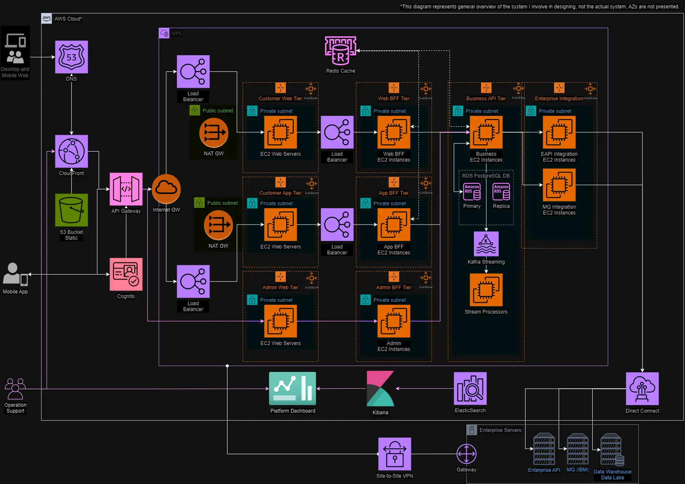

# Wachirawit Umpaipant (Pete) - Business Systems Analyst Portfolio

**Technology Consultant - Sr. Business Systems Analyst**

---

## About Me

Hi there! I'm Pete, a versatile Business Systems Consultant with five years of experience in financial services, software development, and engineering. My expertise lies in technical system design, microservice architecture, and user-centric design for web and mobile platforms. I've led and contributed to several large-scale banking digitization projects, honing my technical skills and collaborating closely with cross-functional teams to deliver impactful solutions.

This page is dedicated to showcasing my experience in systems design projects with a top consulting firm, intended for those interested in a career as a Business Systems Analyst in financial services.

---

## My Skills

### Technical Skills
- **Cloud Technologies & Software Architecture:** AWS (S3, EC2, Lambda, EKS, RDS, DynamoDB), Azure (SQL, Functions, AKS, DevOps), RESTful API, Microservices, Elasticsearch, Kibana, Kafka, Camunda, RDBMS, Async/Stream Processing.
- **Programming & Scripting:** Python, R, SQL, Java, JavaScript, MATLAB, KQL, UML, XML, JSON, Swagger, Git/GitHub, Postman, Debugging.
- **Data & Business Intelligence:** PostgreSQL, MySQL, SQL Server, DynamoDB, Gen AI/ML, Tableau, Power BI, Microsoft Excel, Microsoft Access.
- **UX/UI & Design:** Figma & Figjam, Wireframe, User-Centric Design, User Research, Canva, Unity VR.

### Soft Skills
- **Impact Analysis, Analytical Thinking, Mentoring, Detail-Oriented, Growth Mindset, Communication, Time Management, Adaptability, Leadership, Problem-Solving, Collaboration, Data-Driven Decision-Making.**

---

## Highlighted Projects
### 1. Corporate Banking Platform Revamp

#### Project Overview
- **Objective:** Transform the legacy monolithic architecture of the corporate banking platform into a scalable serverless microservice to system performance, scalability, and user experience.
- **Languages & Tools:** Java, AWS, Kafka, Camunda, SQL, UML.
- **Integrations:** Payment Hub, Enterprise API, Data Lake, IBM MQ, SWIFT Global Payment, AML Reporting.

  Corporate Banking Platform Serverless Architecture (Replica version, not an actual architecture)
  

#### Implemented Features
- **Architecture Redesigned:** Re-architected the platform into structured serverless microservices, allowing independent scaling and faster deployment of new features.
- **Development Techniques:** Utilized asynchronous processing with Kafka and stream processors, and automated processes using Camunda to manage dynamic workflows.
- **Identity and Access Management:** Designed user roles, permissions, and customizable workflows to accommodate various company sizes.
- **Transaction Banking:** Managed immediate, scheduled, and recurring transactions with retry logic. Implemented features for domestic money transfers, remittance, payroll, and bill payments.
- **User Dashboard and Reporting:** Developed consolidated dashboards and automated transaction reports for all transaction products.

#### Results & Business Recommendation
- **Business Impact:** The revamped platform improved system performance by 40%, reduced time-to-market for new features, and enhanced user experience.
- **Reduce Development Effort:** With more Kafka and asynchronous processors and Camunda workflow automation, implementation effort reduced by 20% compared to original assessed solution.

#### My Role
- **Architecture Design:** Contributed to the design of cloud services and laid the foundation for microservices design as a solution architect. Integrated various financial functions with enterprise and legacy systems, ensuring scalability and consistent business logic design and implementation.
- **Solution Design and Implementation:** Designed microservices, databases, APIs, and integrations for multiple services such as IAM, transaction banking, payroll, and bill payment. Developed a dynamic workflow system using Camunda BPMN to automate and manage business processes. Oversaw business logic, functional and technical design of the project.
- **ETL Processes:** Collaborated on designing ETL processes for data auditing and data lake integration. Worked closely with data lake teams to define data fields and auditing requirements.
- **Technical Documentation:** Created comprehensive documentation using sequence diagrams, API Swagger, Camunda BPMN, and DMN rules. Maintained detailed design documents in Confluence throughout the project lifecycle.
- **Testing and Production Support:** Designed test cases, executed sprint tests and system integration testing (SIT), managed defects using Postman, investigated API logs with Kibana and implemented functional dashboards. Provided production support and developed knowledge transition materials.

  Example of Camunda BPMN:
  

---
### 2. Unsecured Loans Digitization for Retail and Small Business Customers

#### Project Overview
- **Objective:** Streamline the loan application process for Retail and Small Business customers by digitizing customer information, integrating advanced KYC verification, and optimizing the user experience with real-time loan offer calculations.
- **Languages & Tools:** Java, Spring Cloud, Camunda, Kafka, Postman, UML, Lucidchart.
- **Integrations:** AWS, PEGA Loan Management, Firebase, Adobe Analytics (MarTech), Google My Business, Kofax OCR.

#### Business Problem
- **Problem Identification:** The traditional unsecured loan application process was time-consuming and error-prone, often requiring multiple document submissions and manual verification.
- **Business Impact:** Delays in loan processing reduced customer satisfaction and increased operational costs.

#### Implemented Features
- **Digital Transformation:** Implemented a digital application process with prefilled customer information from the bank's database, applying business rules and integrating OCR for real-time document verification to minimize resubmissions.
- **Development Techniques:** Utilized Kafka for real-time data streaming and Camunda for process automation, improving processing speed with automated retry processes.
- **KYC Integration:** Deployed government ID verification and facial recognition to prevent fraud.
- **Business Profile Verification:** Integrated Google My Business API for business profile verification.
- **Dynamic Document Upload:** Implemented Kofax OCR for real-time pay slip verification.
- **Loan Calculation and Management:** Included a repayment calculator, real-time disbursement, and amortized loan tracking.

#### Results & Business Recommendation
- **Business Impact:** The digitized process reduced loan processing time by 30%, enhanced customer satisfaction, and enabled instant loan offers, boosting application completion rates by 20%.
- **Risk Reduction:** Integration of real-time KYC and automated document processing significantly reduced fraud and operational costs.

#### My Role
- **Requirement Gathering:** Collaborated with product owners and business analysts to identify key business logic and data requirements.
- **User Stories and Elicitation:** Developed detailed user stories and worked closely with UX/UI designers on user journeys and technical capabilities.
- **Development and Project Management:** Managed tasks in Jira, led development grooming sessions, and created detailed design documentation in Confluence. Ensured the project adhered to Agile methodologies.
- **Solution Design:** Architected serverless microservices, categorized APIs and databases, and employed Kafka and Camunda for process automation. Designed relational databases, Java REST APIs, and sequence diagrams for API calls and database integration with comprehensive documentation in Confluence.
- **Testing and Production Support:** Designed test cases, executed sprint tests and system integration testing (SIT), managed defects using Postman, and investigated API logs with Kibana. Provided production support and developed knowledge transition materials.

---

## Education

- **University of Waterloo** | Master of Applied Science in System Design Engineering | 2022-2024
- **Thammasat University** | Bachelor of Engineering in Electrical Engineering | 2013-2017

---

## Certification

- **Microsoft Certified: Azure Fundamentals** | Jul 2024 | Credential ID: 4FB5AD0A28643626

---

## Contact Me

For more information or to get in touch, please reach out via [Email](mailto:petewachi@outlook.com) or connect with me on [LinkedIn](https://www.linkedin.com/in/umpaipantw).
